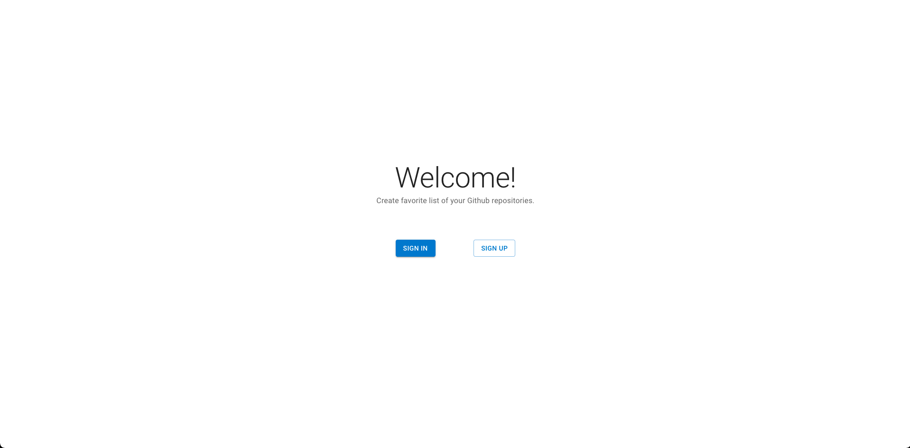
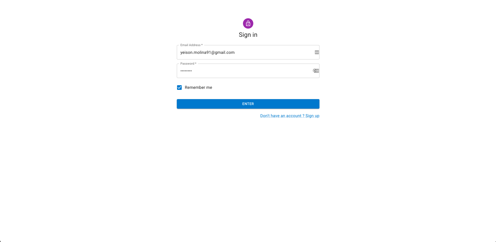
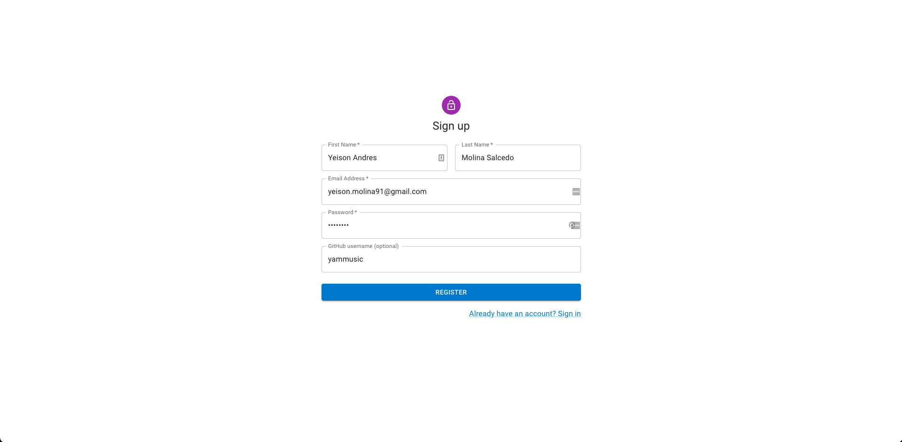
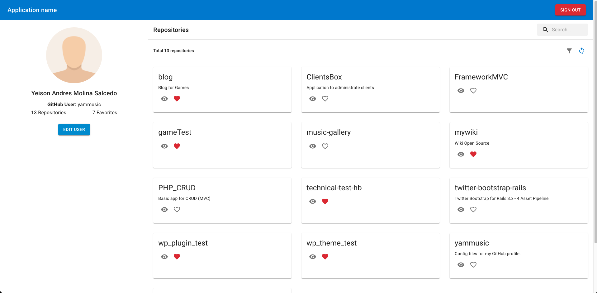

This is a [Next.js](https://nextjs.org/) project bootstrapped with [`create-next-app`](https://github.com/vercel/next.js/tree/canary/packages/create-next-app).

## Cloning project
```bash
git clone https://github.com/yammusic/technical-test-hb.git
```

## Setup

First install all dependencies:
```bash
npm install
# or
yarn install
```

Next you must run the database migration for create a SQLite db (necessary in API side):
```bash
npm run db:migrate
# or
yarn db:migrate
```

And finally run the development server:
```bash
npm run dev
# or
yarn dev
```

Open [http://localhost:3000](http://localhost:3000) with your browser to see the result.

## Screenshots

### Home page


### Login page


### Register page


### Profile page

